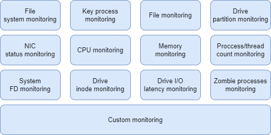

# sysmonitor User Guide

## Introduction

The system monitor (sysmonitor) daemon monitors exceptions that occur during OS running and records the exceptions in the system log file **/var/log/sysmonitor.log**. sysmonitor runs as a service. You can run the `systemctl start|stop|restart|reload sysmonitor` command to start, stop, restart, and reload the service. You are advised to deploy sysmonitor to locate system exceptions.



### Precautions

- sysmonitor cannot run concurrently.
- Ensure that all configuration files are valid. Otherwise, the monitoring service may be abnormal. 
- The root privilege is required for sysmonitor service operations, configuration file modification, and log query. The **root** user has the highest permission in the system. When performing operations as the **root** user, follow the operation guide to avoid system management and security risks caused by improper operations.

### Configuration Overview

Configuration file **/etc/sysconfig/sysmonitor** of sysmonitor defines the monitoring period of each monitoring item and specifies whether to enable monitoring. Spaces are not allowed between the configuration item, equal sign (=), and configuration value, for example, **PROCESS_MONITOR="on"**.

Configuration description

| Item                   | Description                                                  | Mandatory| Default Value                                |
| ------------------------- | ------------------------------------------------------------ | -------- | -------------------------------------- |
| PROCESS_MONITOR           | Whether to enable key process monitoring. The value can be **on** or **off**.               | No      | on                                   |
| PROCESS_MONITOR_PERIOD    | Monitoring period on key processes, in seconds.                              | No      | 3                                     |
| PROCESS_RECALL_PERIOD     | Interval for attempting to restart a key process after the process fails to be recovered, in minutes. The value can be an integer ranging from 1 to 1440.| No      | 1                                   |
| PROCESS_RESTART_TIMEOUT   | Timeout interval for recovering a key process service from an exception, in seconds. The value can be an integer ranging from 30 to 300.| No      | 90                                    |
| PROCESS_ALARM_SUPRESS_NUM | Number of alarm suppression times when the key process monitoring configuration uses the alarm command to report alarms. The value is a positive integer.| No      | 5                                      |
| FILESYSTEM_MONITOR        | Whether to enable ext3 and ext4 file system monitoring. The value can be **on** or **off**.  | No      | on                                   |
| DISK_MONITOR              | Whether to enable drive partition monitoring. The value can be **on** or **off**.              | No      | on                                   |
| DISK_MONITOR_PERIOD       | Drive monitoring period, in seconds.                                    | No      | 60                                    |
| INODE_MONITOR             | Whether to enable drive inode monitoring. The value can be **on** or **off**.         | No      | on                                   |
| INODE_MONITOR_PERIOD      | Drive inode monitoring period, in seconds.                             | No      | 60                                   |
| NETCARD_MONITOR           | Whether to enable NIC monitoring. The value can be **on** or **off**.                | No      | on                                   |
| FILE_MONITOR              | Whether to enable file monitoring. The value can be **on** or **off**.                 | No      | on                                   |
| CPU_MONITOR               | Whether to enable CPU monitoring. The value can be **on** or **off**.                   | No      | on                                   |
| MEM_MONITOR               | Whether to enable memory monitoring. The value can be **on** or **off**.                    | No      | on                                   |
| PSCNT_MONITOR             | Whether to enable process count monitoring. The value can be **on** or **off**.                    | No      | on                                   |
| FDCNT_MONITOR             | Whether to enable file descriptor (FD) count monitoring. The value can be **on** or **off**.                 | No      | on                                   |
| CUSTOM_DAEMON_MONITOR     | Whether to enable custom daemon item monitoring. The value can be **on** or **off**.        | No      | on                                   |
| CUSTOM_PERIODIC_MONITOR   | Whether to enable custom periodic item monitoring. The value can be **on** or **off**.   | No      | on                                   |
| IO_DELAY_MONITOR          | Whether to enable local drive I/O latency monitoring. The value can be **on** or **off**.             | No      | off                                   |
| PROCESS_FD_NUM_MONITOR    | Whether to enable process FD count monitoring. The value can be **on** or **off**.        | No      | on                                   |
| PROCESS_MONITOR_DELAY     | Whether to wait until all monitoring items are normal when sysmonitor is started. The value can be **on** (wait) or **off** (do not wait).| No      | on                                   |
| NET_RATE_LIMIT_BURST      | NIC route information printing rate, that is, the number of logs printed per second.        | No      | 5 <br>Valid range: 0 to 100     |
| FD_MONITOR_LOG_PATH       | FD monitoring log file                                        | No      | /var/log/sysmonitor.log|
| ZOMBIE_MONITOR            | Whether to monitor zombie processes                                            | No      | off                                   |
| CHECK_THREAD_MONITOR      | Whether to enable internal thread self-healing. The value can be **on** or **off**.                       | No      | on       |
| CHECK_THREAD_FAILURE_NUM  | Number of internal thread self-healing checks in a period.                                  | No      | 3<br>Valid range: 2 to 10             |

- After modifying the **/etc/sysconfig/sysmonitor** configuration file, restart the sysmonitor service for the configurations to take effect. 
- If an item is not configured in the configuration file, it is enabled by default.
- After the internal thread self-healing function is enabled, if a sub-thread of the monitoring item is suspended and the number of checks in a period exceeds the configured value, the sysmonitor service is restarted for restoration. The configuration is reloaded. The configured key process monitoring and customized monitoring are restarted. If this function affects user experience, you can disable it.

### Command Reference

- Start sysmonitor.

```shell
systemctl start sysmonitor
```

- Stop sysmonitor.

```shell
systemctl stop sysmonitor
```

- Restart sysmonitor.

```shell
systemctl restart sysmonitor
```

- Reload sysmonitor for the modified configurations to take effect.

```shell
systemctl reload sysmonitor
```

### Monitoring Logs

By default, logs is split and dumped to prevent the **sysmonitor.log** file from getting to large. Logs are dumped to a drive directory. In this way, a certain number of logs can be retained.

The configuration file is **/etc/rsyslog.d/sysmonitor.conf**. Because this rsyslog configuration file is added, after sysmonitor is installed for the first time, you need to restart the rsyslog service to make the sysmonitor log configuration take effect.

```text
$template sysmonitorformat,"%TIMESTAMP:::date-rfc3339%|%syslogseverity-text%|%msg%\n"

$outchannel sysmonitor, /var/log/sysmonitor.log, 2097152, /usr/libexec/sysmonitor/sysmonitor_log_dump.sh
if ($programname == 'sysmonitor' and $syslogseverity <= 6) then {
:omfile:$sysmonitor;sysmonitorformat
stop
}

if ($msg contains 'Time has been changed') then {
:omfile:$sysmonitor;sysmonitorformat
stop
}

if ($programname == 'sysmonitor' and $syslogseverity > 6) then {
/dev/null
stop
}
```

## ext3/ext4 Filesystem Monitoring

### Introduction

A fault in the filesystem may trigger I/O operation errors, which further cause OS faults. File system fault detection can detect the faults in real time so that system administrators or users can rectify them in a timely manner.

### Configuration File Description

None

### Exception Logs

For a file system to which the errors=remount-ro mounting option is added, if the ext3 or ext4 file system is faulty, the following exception information is recorded in the **sysmonitor.log** file:

```text
info|sysmonitor[127]: loop0 filesystem error. Remount filesystem read-only.
```

In other exception scenarios, if the ext3 or ext4 file system is faulty, the following exception information is recorded in the **sysmonitor.log** file:

```text
info|sysmonitor[127]: fs_monitor_ext3_4: loop0 filesystem error. flag is 1879113728.
```

## Key Processing Monitoring

### Introduction

Key processes in the system are periodically monitored. When a key process exits abnormally, sysmonitor automatically attempts to recover the key process. If the recovery fails, alarms can be reported. The system administrator can be promptly notified of the abnormal process exit event and whether the process is restarted. Fault locating personnel can locate the time when the process exits abnormally from logs.

### Configuration File Description

The configuration file directory is **/etc/sysmonitor/process**. Each process or module corresponds to a configuration file.

```text
USER=root
NAME=irqbalance
RECOVER_COMMAND=systemctl restart irqbalance
MONITOR_COMMAND=systemctl status irqbalance
STOP_COMMAND=systemctl stop irqbalance
```

The configuration items are as follows:

| Item                | Description                                                  | Mandatory| Default Value                                             |
| ---------------------- | ------------------------------------------------------------ | -------- | --------------------------------------------------- |
| NAME                   | Process or module name                                                | Yes      | None                                                 |
| RECOVER_COMMAND        | Recovery command                                                    | No      | None                                                 |
| MONITOR_COMMAND        | Monitoring command<br> If the command output is 0, the process is normal. If the command output is greater than 0, the process is abnormal.| No      | pgrep -f $(which xxx)<br>*xxx* is the process name configured in the **NAME** field.|
| STOP_COMMAND           | Stopping command                                                    | No      | None                                                 |
| USER                   | User name<br>User for executing the monitoring, recovery, and stopping commands or scripts | No      | If this item is left blank, the **root** user is used by default.                    |
| CHECK_AS_PARAM         | Parameter passing switch<br>If this item is on, the return value of **MONITOR_COMMAND** is transferred to the **RECOVER_COMMAND** command or script as an input parameter. If this item is set to off or other values, the function is disabled.| No      | None                                                 |
| MONITOR_MODE           | Monitoring mode<br>- **parallel** or **serial**<br> | No      | serial                                              |
| MONITOR_PERIOD         | Monitoring period<br>- Parallel monitoring period<br>- This item does not take effect when the monitoring mode is **serial**.| No      | 3                                                   |
| USE_CMD_ALARM          | Alarm mode<br>If this parameter is set to **on** or **ON**, alarms are reported using the alarm reporting command.       | No      | None                                                 |
| ALARM_COMMAND          | Alarm reporting command                                                | No      | None                                                 |
| ALARM_RECOVER_COMMAND | Alarm recovery command                                                | No      | No                                                 |

- After modifying the configuration file for monitoring key processes, run `systemctl reload sysmonitor`. The new configuration takes effect after a monitoring period.
- The recovery command and monitoring command must not block. Otherwise, the monitoring thread of the key process becomes abnormal.
- When the recovery command is executed for more than 90 seconds, the stopping command is executed to stop the process.
- If the recovery command is empty or not configured, the monitoring command does not attempt to recover the key process when detecting that the key process is abnormal.
- If a key process is abnormal and fails to be started for three consecutive times, the process is started based on the period specified by **PROCESS_RECALL_PERIOD** in the global configuration file.
- If the monitored process is not a daemon process, **MONITOR_COMMAND** is mandatory.
- If the configured key service does not exist in the current system, the monitoring does not take effect and the corresponding information is printed in the log. If a fatal error occurs in other configuration items, the default configuration is used and no error is reported.
- The permission on the configuration file is 600. You are advised to set the monitoring item to the **service** type of systemd (for example, **MONITOR_COMMAND=systemctl status irqbalance**). If a process is monitored, ensure that the **NAME** field is an absolute path.
- The restart, reload, and stop of sysmonitor do not affect the monitored processes or services.
- If **USE_CMD_ALARM** is set to **on**, you must ensure the validiy of **ALARM_COMMAND** and **ALARM_RECOVER_COMMAND**. If **ALARM_COMMAND** or **ALARM_RECOVER_COMMAND** is empty or not configured, no alarm is reported.
- The security of user-defined commands, such as the monitoring, recovery, stopping, alarm reporting, and alarm recovery commands, is ensured by users. Commands are executed by the user **root**. You are advised to set the script command permission to be used only by the user **root** to prevent privilege escalation for common users.
- If the length of the monitoring command cannot be greater than 200 characters. Otherwise, the process monitoring fails to be added.
- When the recovery command is set to a systemd service restart command (for example, **RECOVER_COMMAND=systemctl restart irqbalance**), check whether the recovery command conflicts with the open source systemd service recovery mechanism. Otherwise, the behavior of key processes may be affected after exceptions occur.
- The processes started by the sysmonitor service are in the same cgroup as the sysmonitor service, and resources cannot be restricted separately. Therefore, you are advised to use the open source systemd mechanism to recover the processes.

### Exception Logs

- **RECOVER_COMMAND** configured

  If a process or module exception is detected, the following exception information is recorded in the **/var/log/sysmonitor.log** file:

  ```text
  info|sysmonitor[127]: irqbalance is abnormal, check cmd return 1, use "systemctl restart irqbalance" to recover
  ```

  If the process or module recovers, the following information is recorded in the **/var/log/sysmonitor.log** file:

  ```text
  info|sysmonitor[127]: irqbalance is recovered
  ```

- **RECOVER_COMMAND** not configured

  If a process or module exception is detected, the following exception information is recorded in the **/var/log/sysmonitor.log** file:

  ```text
  info|sysmonitor[127]: irqbalance is abnormal, check cmd return 1, recover cmd is null, will not recover
  ```

  If the process or module recovers, the following information is recorded in the **/var/log/sysmonitor.log** file:

  ```text
  info|sysmonitor[127]: irqbalance is recovered
  ```

## File Monitoring

### Introduction

If key system files are deleted accidentally, the system may run abnormally or even break down. Through file monitoring, you can learn about the deletion of key files or the addition of malicious files in the system in a timely manner, so that administrators and users can learn and rectify faults in a timely manner.

### Configuration File Description

The configuration file is **/etc/sysmonitor/file**. Each monitoring configuration item occupies a line. A monitoring configuration item contains the file (directory) and event to be monitored. The file (directory) to be monitored is an absolute path. The file (directory) to be monitored and the event to be monitored are separated by one or more spaces.

The file monitoring configuration items can be added to the **/etc/sysmonitor/file.d** directory. The configuration method is the same as that of the **/etc/sysmonitor/file** directory.

- Due to the log length limit, it is recommended that the absolute path of a file or directory be less than 223 characters. Otherwise, the printed logs may be incomplete.

- Ensure that the path of the monitored file is correct. If the configured file does not exist or the path is incorrect, the file cannot be monitored.

- Due to the path length limit of the system, the absolute path of the monitored file or directory must be less than 4096 characters.

- Directories and regular files can be monitored. **/proc**, **/proc/\***, **/dev**, **/dev/\***, **/sys**, **/sys/\***, pipe files, or socket files cannot be monitored.

- Only deletion events can be monitored in **/var/log** and **/var/log/\***.

- If multiple identical paths exist in the configuration file, the first valid configuration takes effect. In the log file, you can see messages indicating that the identical paths are ignored.

- Soft links cannot be monitored. When a hard link file deletion event is configured, the event is printed only after the file and all its hard links are deleted.

- When a monitored event occurs after the file monitoring is successfully added, the monitoring log records the absolute path of the configured file.

- Currently, directories cannot be monitored recursively. The configured directory is monitored but not its subdirectories.

- The events to be monitored are configured using bitmaps as follows.

```text
  -------------------------------
  | 11~32   | 10   | 9   |  1~8 | 
  -------------------------------
```

Each bit in the event bitmap represents an event. If bit _n_ is set to 1, the event corresponding to bit _n_ is monitored. The hexadecimal number corresponding to the monitoring bitmap is the event monitoring item written to the configuration file.

| Item| Description        | Mandatory|
| ------ | ------------------ | -------- |
| 1~8    | Reserved              | No      |
| 9      | File or directory addition event| Yes      |
| 10     | File or directory deletion event| Yes      |
| 11~32  | Reserved              | No      |

- After modifying the file monitoring configuration file, run `systemctl reload sysmonitor`. The new configuration takes effect within 60 seconds.
- Strictly follow the preceding rules to configure events to be monitored. If the configuration is incorrect, the events cannot be monitored. If an event to be monitored in the configuration item is empty, only the deletion event is monitored by default, that is, **0x200**.
- After a file or directory is deleted, the deletion event is reported only when all processes that open the file stop.
- If a monitored a is modified by `vi` or `sed`, "File XXX may have been changed" is recorded in the monitoring log.
- Currently, file addition and deletion events can be monitored, that is, the ninth and tenth bits take effect. Other bits are reserved and do not take effect. If a reserved bit is configured, the monitoring log displays a message indicating that the event monitoring is incorrectly configured.

**Example**

Monitor the subdirectory addition and deletion events in **/home**. The lower 12-bit bitmap is 001100000000. The configuration is as follows:

```text
/home 0x300
```

Monitor the file deletion events of **/etc/ssh/sshd_config**. The lower 12-bit bitmap is 001000000000. The configuration is as follows:

```text
/etc/sshd/sshd_config 0x200
```

### Exception Logs

If a configured event occurs to the monitored file, the following information is displayed in the **/var/log/sysmonitor.log** file:

```text
info|sysmonitor[127]: 1 events queued
info|sysmonitor[127]: 1th events handled
info|sysmonitor[127]: Subfile "111" under "/home" was added.
```

## Drive Partition Monitoring

### Introduction

The system periodically monitors the drive partitions mounted to the system. When the drive partition usage is greater than or equal to the configured alarm threshold, the system records a drive space alarm. When the drive partition usage falls below the configured alarm recovery threshold, a drive space recovery alarm is recorded.

### Configuration File Description

The configuration file is **/etc/sysmonitor/disk**.

```text
DISK="/var/log"  ALARM="90" RESUME="80"
DISK="/" ALARM="95" RESUME="85"
```

| Item| Description            | Mandatory| Default Value|
| ------ | ---------------------- | -------- | ------ |
| DISK   | Mount directory        | Yes      | None    |
| ALARM  | Integer indicating the drive space alarm threshold| No      | 90     |
| RESUME | Integer indicating the drive space alarm recovery threshold| No      | 80     |

- After modifying the configuration file for drive space monitoring, run `systemctl reload sysmonitor`. The new configuration takes effect after a monitoring period.
- If a mount directory is configured repeatedly, the last configuration item takes effect.
- The value of **ALARM** must be greater than that of **RESUME**.
- Only the mount point or the drive partition of the mount point can be monitored.
- When the CPU usage and I/O usage are high, the `df` command execution may time out. As a result, the drive usage cannot be obtained.
- If a drive partition is mounted to multiple mount points, an alarm is reported for each mount point.

### Exception Logs

If a drive space alarm is detected, the following information is displayed in the **/var/log/sysmonitor.log** file:

```text
warning|sysmonitor[127]: report disk alarm, /var/log used:90% alarm:90%
info|sysmonitor[127]: report disk recovered, /var/log used:4% resume:10%
```

## NIC Status Monitoring

### Introduction

During system running, the NIC status or IP address may change due to human factors or exceptions. You can monitor the NIC status and IP address changes to detect exceptions in a timely manner and locate exception causes.

### Configuration File Description

The configuration file is **/etc/sysmonitor/network**.

```text
#dev event
eth1 UP
```

The following table describes the configuration items.

| Item| Description                                                  | Mandatory| Default Value                                           |
| ------ | ------------------------------------------------------------ | -------- | ------------------------------------------------- |
| dev    | NIC name                                                      | Yes      | None                                               |
| event  | Event to be monitored. The value can be **UP**, **DOWN**, **NEWADDR**, or **DELADDR**.<br>- UP: The NIC is up.<br>- DOWN: The NIC is down.<br>- NEWADDR: An IP address is added.<br>- DELADDR: An IP address is deleted.| No      | If this item is empty, **UP**, **DOWN**, **NEWADDR**, and **DELADDR** are monitored.|

- After modifying the configuration file for NIC monitoring, run `systemctl reload sysmonitor` for the new configuration to take effect.
- The **UP** and **DOWN** status of virtual NICs cannot be monitored.
- Ensure that each line in the NIC monitoring configuration file contains less than 4096 characters. Otherwise, a configuration error message will be recorded in the monitoring log.
- By default, all events of all NICs are monitored. That is, if no NIC monitoring is configured, the **UP**, **DOWN**, **NEWADDR**, and **DELADDR** events of all NICs are monitored.
- If a NIC is configured but no event is configured, all events of the NIC are monitored by default.
- The events of route addition can be recorded five times per second. You can change the number of times by setting **NET_RATE_LIMIT_BURST** in **/etc/sysconfig/sysmonitor**.

### Exception Logs

If a NIC event is detected, the following information is displayed in the **/var/log/sysmonitor.log** file:

```text
info|sysmonitor[127]: lo: ip[::1] prefixlen[128] is added, comm: (ostnamed)[1046], parent comm: syst    emd[1]
info|sysmonitor[127]: lo: device is up, comm: (ostnamed)[1046], parent comm: systemd[1]
```

If a route event is detected, the following information is displayed in the **/var/log/sysmonitor.log** file:

```text
info|sysmonitor[881]: Fib4 replace table=255 192.168.122.255/32, comm: daemon-init[1724], parent com    m: systemd[1]
info|sysmonitor[881]: Fib4 replace table=254 192.168.122.0/24, comm: daemon-init[1724], parent comm:     systemd[1]
info|sysmonitor[881]: Fib4 replace table=255 192.168.122.0/32, comm: daemon-init[1724], parent comm:     systemd[1]
info|sysmonitor[881]: Fib6 replace fe80::5054:ff:fef6:b73e/128, comm: kworker/1:3[209], parent comm:     kthreadd[2]
```

## CPU Monitoring

### Introduction

The system monitors the global CPU usage or the CPU usage in a specified domain. When the CPU usage exceeds the configured alarm threshold, the system runs the configured log collection command.

### Configuration File Description

The configuration file is **/etc/sysmonitor/cpu**.

When the global CPU usage of the system is monitored, an example of the configuration file is as follows:

```text
# cpu usage alarm percent
ALARM="90"

# cpu usage alarm resume percent
RESUME="80"

# monitor period (second)
MONITOR_PERIOD="60"

# stat period (second)
STAT_PERIOD="300"

# command executed when cpu usage exceeds alarm percent
REPORT_COMMAND=""
```

When the CPU usage of a specific domain is monitored, an example of the configuration file is as follows:

```text
# monitor period (second)
MONITOR_PERIOD="60"

# stat period (second)
STAT_PERIOD="300"

DOMAIN="0,1"  ALARM="90" RESUME="80"
DOMAIN="2,3"  ALARM="50" RESUME="40"

# command executed when cpu usage exceeds alarm percent
REPORT_COMMAND=""
```

| Item        | Description                                                  | Mandatory| Default Value|
| -------------- | ------------------------------------------------------------ | -------- | ------ |
| ALARM          | Number greater than 0, indicating the CPU usage alarm threshold                                   | No      | 90     |
| RESUME         | Number greater than or equal to 0, indicating the CPU usage alarm recovery threshold                               | No      | 80     |
| MONITOR_PERIOD | Monitoring period, in seconds. The value is greater than 0.                                   | No      | 60     |
| STAT_PERIOD    | Statistical period, in seconds. The value is greater than 0.                                   | No      | 300    |
| DOMAIN         | CPU IDs in the domain, represented by decimal numbers<br>- CPU IDs can be enumerated and separated by commas, for example, **1,2,3**. CPU IDs can be specified as a range in the format of _X_-_Y_, for example, **0-2**. The two representations can be used together, for example, **0, 1, 2-3** or **0-1, 2-3**. Spaces or other characters are not allowed.<br>- Each monitoring domain has an independent configuration item. Each configuration item supports a maximum of 256 CPUs. A CPU ID must be unique in a domain and across domains.| No      | None    |
| REPORT_COMMAND | Command for collecting logs after the CPU usage exceeds the alarm threshold                      | No      | None    |

- After modifying the configuration file for CPU monitoring, run `systemctl reload sysmonitor`. The new configuration takes effect after a monitoring period.
- The value of **ALARM** must be greater than that of **RESUME**.
- After the CPU domain monitoring is configured, the global average CPU usage of the system is not monitored, and the separately configured **ALARM** and **RESUME** values do not take effect.
- If the configuration of a monitoring domain is invalid, CPU monitoring is not performed at all.
- All CPUs configured in **DOMAIN** must be online. Otherwise, the domain cannot be monitored.
- The command of **REPORT_COMMAND** cannot contain insecure characters such as **&**, **;**, and **>**, and the total length cannot exceed 159 characters. Otherwise, the command cannot be executed.
- Ensure the security and validity of **REPORT_COMMAND**. sysmonitor is responsible only for running the command as the **root** user.
- **REPORT_COMMAND** must not block. When the execution time of the command exceeds 60s, the sysmonitor forcibly stops the execution.
- Even if the CPU usage of multiple domains exceeds the threshold in a monitoring period, **REPORT_COMMAND** is executed only once.

### Exception Logs

If a global CPU usage alarm is detected or cleared and the log collection command is configured, the following information is displayed in the **/var/log/sysmonitor.log** file:

```text
info|sysmonitor[127]: CPU usage alarm: 91.3%
info|sysmonitor[127]: cpu monitor: execute REPORT_COMMAND[sysmoniotrcpu] successfully
info|sysmonitor[127]: CPU usage resume 70.1%
```

If a domain average CPU usage alarm is detected or cleared and the log collection command is configured, the following information is displayed in the **/var/log/sysmonitor.log** file:

```text
info|sysmonitor[127]: CPU 1,2,3 usage alarm: 91.3%
info|sysmonitor[127]: cpu monitor: execute REPORT_COMMAND[sysmoniotrcpu] successfully
info|sysmonitor[127]: CPU 1,2,3 usage resume 70.1%
```

## Memory Monitoring

### Introduction

Monitors the system memory usage and records logs when the memory usage exceeds or falls below the threshold.

### Configuration File Description

The configuration file is **/etc/sysmonitor/memory**.

```text
# memory usage alarm percent
ALARM="90"

# memory usage alarm resume percent
RESUME="80"

# monitor period(second)
PERIOD="60"
```

### Configuration Item Description

| Item| Description                   | Mandatory| Default Value|
| ------ | ----------------------------- | -------- | ------ |
| ALARM  | Number greater than 0, indicating the memory usage alarm threshold    | No      | 90     |
| RESUME | Number greater than or equal to 0, indicating the memory usage alarm recovery threshold| No      | 80     |
| PERIOD | Monitoring period, in seconds. The value is greater than 0.   | No      | 60     |

- After modifying the configuration file for memory monitoring, run `systemctl reload sysmonitor`. The new configuration takes effect after a monitoring period.
- The value of **ALARM** must be greater than that of **RESUME**.
- The average memory usage in three monitoring periods is used to determine whether an alarm is reported or cleared.

### Exception Logs

If a memory alarm is detected, sysmonitor obtains the **/proc/meminfo** information and prints the information in the **/var/log/sysmonitor.log** file. The information is as follows:

```text
info|sysmonitor[127]: memory usage alarm: 90%
info|sysmonitor[127]:---------------show /proc/meminfo: ---------------
info|sysmonitor[127]:MemTotal: 3496388 kB
info|sysmonitor[127]:MemFree: 2738100 kB
info|sysmonitor[127]:MemAvailable: 2901888 kB
info|sysmonitor[127]:Buffers: 165064 kB
info|sysmonitor[127]:Cached: 282360 kB
info|sysmonitor[127]:SwapCached: 4492 kB
......
info|sysmonitor[127]:---------------show_memory_info end. ---------------
```

If the following information is printed, sysmonitor runs `echo m > /proc/sysrq-trigger` to export memory allocation information. You can view the information in **/var/log/messages**.

```text
info|sysmonitor[127]: sysrq show memory ifno in message.
```

When the alarm is recovered, the following information is displayed:

```text
info|sysmonitor[127]: memory usage resume: 4.6%
```

## Process and Thread Monitoring

### Introduction

Monitors the number of processes and threads. When the total number of processes or threads exceeds or falls below the threshold, a log is recorded or an alarm is reported.

### Configuration File Description

The configuration file is **/etc/sysmonitor/pscnt**.

```text
# number of processes(include threads) when alarm occur
ALARM="1600"

# number of processes(include threads) when alarm resume
RESUME="1500"

# monitor period(second)
PERIOD="60"

# process count usage alarm percent
ALARM_RATIO="90"

# process count usage resume percent
RESUME_RATIO="80"

# print top process info with largest num of threads when threads alarm
# (range: 0-1024, default: 10, monitor for thread off:0)
SHOW_TOP_PROC_NUM="10"
```

| Item           | Description                                                  | Mandatory| Default Value|
| ----------------- | ------------------------------------------------------------ | -------- | ------ |
| ALARM             | Integer greater than 0, indicating the process count alarm threshold                             | No      | 1600   |
| RESUME            | Integer greater than or equal to 0, indicating the process count alarm recovery threshold                           | No      | 1500   |
| PERIOD            | Monitoring period, in seconds. The value is greater than 0.                                   | No      | 60     |
| ALARM_RATIO       | Number greater than 0 and less than or equal to 100. Process count alarm threshold.        | No      | 90     |
| RESUME_RATIO      | Number greater than 0 and less than or equal to 100. Process count alarm recovery threshold, which must be less than **ALARM_RATIO**.| No      | 80     |
| SHOW_TOP_PROC_NUM | Whether to use the latest `top` information about threads                             | No      | 10     |

- After modifying the configuration file for process count monitoring, run `systemctl reload sysmonitor`. The new configuration takes effect after a monitoring period.
- The value of **ALARM** must be greater than that of **RESUME**.
- The process count alarm threshold is the larger between **ALARM** and **ALARM_RATIO** in **/proc/sys/kernel/pid_max**. The alarm recovery threshold is the larger of **RESUME** and **RESUME_RATIO** in **/proc/sys/kernel/pid_max**.
- The thread count alarm threshold is the larger between **ALARM** and **ALARM_RATIO** in **/proc/sys/kernel/threads-max**. The alarm recovery threshold is the larger of **RESUME** and **RESUME_RATIO** in **/proc/sys/kernel/threads-max**.
- The value of **SHOW_TOP_PROC_NUM** ranges from 0 to 1024. 0 indicates that thread monitoring is disabled. A larger value, for example, 1024, indicates that thread alarms will be generated in the environment. If the alarm threshold is high, the performance is affected. You are advised to set this parameter to the default value 10 or a smaller value. If the impact is huge, you are advised to set this parameter to 0 to disable thread monitoring.
- The value of **PSCNT_MONITOR** in **/etc/sysconfig/sysmonitor** and the value of **SHOW_TOP_PROC_NUM** in **/etc/sysmonitor/pscnt** determine whether thread monitoring is enabled.
    - If **PSCNT_MONITOR** is on and **SHOW_TOP_PROC_NUM** is set to a valid value, thread monitoring is enabled.
    - If **PSCNT_MONITOR** is on and **SHOW_TOP_PROC_NUM** is 0, thread monitoring is disabled.
    - If **PSCNT_MONITOR** is off, thread monitoring is disabled.
- When a process count alarm is generated, the system FD usage information and memory information (**/proc/meminfo**) are printed.
- When a thread count alarm is generated, the total number of threads, `top` process information, number of processes in the current environment, number of system FDs, and memory information (**/proc/meminfo**) are printed.
- If system resources are insufficient before a monitoring period ends, for example, the thread count exceeds the maximum number allowed, the monitoring cannot run properly due to resource limitation. As a result, the alarm cannot be generated.

### Exception Logs

If a process count alarm is detected, the following information is displayed in the **/var/log/sysmonitor.log** file:

```text
info|sysmonitor[127]:---------------process count alarm start: ---------------
info|sysmonitor[127]: process count alarm:1657
info|sysmonitor[127]: process count alarm, show sys fd count: 2592
info|sysmonitor[127]: process count alarm, show mem info
info|sysmonitor[127]:---------------show /proc/meminfo: ---------------
info|sysmonitor[127]:MemTotal: 3496388 kB
info|sysmonitor[127]:MemFree: 2738100 kB
info|sysmonitor[127]:MemAvailable: 2901888 kB
info|sysmonitor[127]:Buffers: 165064 kB
info|sysmonitor[127]:Cached: 282360 kB
info|sysmonitor[127]:SwapCached: 4492 kB
......
info|sysmonitor[127]:---------------show_memory_info end. ---------------
info|sysmonitor[127]:---------------process count alarm end: ---------------
```

If a process count recovery alarm is detected, the following information is displayed in the **/var/log/sysmonitor.log** file:

```text
info|sysmonitor[127]: process count resume: 1200
```

If a thread count alarm is detected, the following information is displayed in the **/var/log/sysmonitor.log** file:

```text
info|sysmonitor[127]:---------------threads count alarm start: ---------------
info|sysmonitor[127]:threads count alarm: 273
info|sysmonitor[127]:open threads most 10 processes is [top1:pid=1756900,openthreadsnum=13,cmd=/usr/bin/sysmonitor --daemon]
info|sysmonitor[127]:open threads most 10 processes is [top2:pid=3130,openthreadsnum=13,cmd=/usr/lib/gassproxy -D]
.....
info|sysmonitor[127]:---------------threads count alarm end. ---------------
```

## System FD Count Monitoring

### Introduction

Monitors the number of system FDs. When the total number of system FDs exceeds or is less than the threshold, a log is recorded.

### Configuration File Description

The configuration file is **/etc/sysmonitor/sys_fd_conf**.

```text
# system fd usage alarm percent
SYS_FD_ALARM="80"
# system fd usage alarm resume percent
SYS_FD_RESUME="70"
# monitor period (second)
SYS_FD_PERIOD="600"
```

Configuration items:

| Item       | Description                                               | Mandatory| Default Value|
| ------------- | --------------------------------------------------------- | -------- | ------ |
| SYS_FD_ALARM  | Integer greater than 0 and less than 100, indicating the alarm threshold of the percentage of the total number of FDs and the maximum number of FDs allowed.| No      | 80    |
| SYS_FD_RESUME | Integer greater than 0 and less than 100, indicating the alarm recovery threshold of the percentage of the total number of FDs and the maximum number of FDs allowed.| No      | 70    |
| SYS_FD_PERIOD | Integer between 100 and 86400, indicating the monitor period in seconds               | No      | 600    |

- After modifying the configuration file for FD count monitoring, run `systemctl reload sysmonitor`. The new configuration takes effect after a monitoring period.
- The value of **SYS_FD_ALARM** must be greater than that of **SYS_FD_RESUME**. If the value is invalid, the default value is used and a log is recorded.

### Exception Logs

An FD count alarm is recorded in the monitoring logs when detected. The following information is displayed in the **/var/log/sysmonitor.log** file:

```text
info|sysmonitor[127]: sys fd count alarm: 259296
```

When a system FD usage alarm is generated, the top three processes that use the most FDs are printed.

```text
info|sysmonitor[127]:open fd most three processes is:[top1:pid=23233,openfdnum=5000,cmd=/home/openfile]
info|sysmonitor[127]:open fd most three processes is:[top2:pid=23267,openfdnum=5000,cmd=/home/openfile]
info|sysmonitor[127]:open fd most three processes is:[top3:pid=30144,openfdnum=5000,cmd=/home/openfile]
```

## Drive Inode Monitoring

### Introduction

Periodically monitors the inodes of mounted drive partitions. When the drive partition inode usage is greater than or equal to the configured alarm threshold, the system records a drive inode alarm. When the drive inode usage falls below the configured alarm recovery threshold, a drive inode recovery alarm is recorded.

### Configuration File Description

The configuration file is **/etc/sysmonitor/inode**.

```text
DISK="/"
DISK="/var/log"
```

| Item| Description               | Mandatory| Default Value|
| ------ | ------------------------- | -------- | ------ |
| DISK   | Mount directory           | Yes      | None    |
| ALARM  | Integer indicating the drive inode alarm threshold| No      | 90     |
| RESUME | Integer indicating the drive inode alarm recovery threshold| No      | 80     |

- After modifying the configuration file for drive inode monitoring, run `systemctl reload sysmonitor`. The new configuration takes effect after a monitoring period.
- If a mount directory is configured repeatedly, the last configuration item takes effect.
- The value of **ALARM** must be greater than that of **RESUME**.
- Only the mount point or the drive partition of the mount point can be monitored.
- When the CPU usage and I/O usage are high, the `df` command execution may time out. As a result, the drive inode usage cannot be obtained.
- If a drive partition is mounted to multiple mount points, an alarm is reported for each mount point.

### Exception Logs

If a drive inode alarm is detected, the following information is displayed in the **/var/log/sysmonitor.log** file:

```text
info|sysmonitor[4570]:report disk inode alarm, /var/log used:90% alarm:90%
info|sysmonitor[4570]:report disk inode recovered, /var/log used:79% alarm:80%
```

## Local Drive I/O Latency Monitoring

### Introduction

Reads the local drive I/O latency data every 5 seconds and collects statistics on 60 groups of data every 5 minutes. If more than 30 groups of data are greater than the configured maximum I/O latency, the system records a log indicating excessive drive I/O latency.

### Configuration File Description

The configuration file is **/etc/sysmonitor/iodelay**.

```text
DELAY_VALUE="500"
```

| Item     | Description          | Mandatory| Default Value|
| ----------- | -------------------- | -------- | ------ |
| DELAY_VALUE | Maximum drive I/O latency| Yes      | 500    |

### Exception Logs

If a drive I/O latency alarm is detected, the following information is displayed in the **/var/log/sysmonitor.log** file:

```text
info|sysmonitor[127]:local disk sda IO delay is too large, I/O delay threshold is 70.
info|sysmonitor[127]:disk is sda, io delay data: 71 72 75 87 99 29 78 ......
```

If a drive I/O latency recovery alarm is detected, the following information is displayed in the **/var/log/sysmonitor.log** file:

```text
info|sysmonitor[127]:local disk sda IO delay is normal, I/O delay threshold is 70.
info|sysmonitor[127]:disk is sda, io delay data: 11 22 35 8 9 29 38 ......
```

## Zombie Process Monitoring

### Introduction

Monitors the number of zombie processes in the system. If the number is greater than the alarm threshold, an alarm log is recorded. When the number drops lower than the recovery threshold, a recovery alarm is reported.

### Configuration File Description

The configuration file is **/etc/sysmonitor/zombie**.

```text
# Ceiling zombie process counts of alarm
ALARM="500"

# Floor zombie process counts of resume
RESUME="400"

# Periodic (second)
PERIOD="600"
```

| Item| Description                     | Mandatory| Default Value|
| ------ | ------------------------------- | -------- | ------ |
| ALARM  | Number greater than 0, indicating the zombie process count alarm threshold    | No      | 500    |
| RESUME | Number greater than or equal to 0, indicating the zombie process count recovery threshold| No      | 400    |
| PERIOD | Monitoring period, in seconds. The value is greater than 0.      | No      | 60     |

### Exception Logs

If a zombie process count alarm is detected, the following information is displayed in the **/var/log/sysmonitor.log** file:

```text
info|sysmonitor[127]: zombie process count alarm: 600
info|sysmonitor[127]: zombie process count resume: 100
```

## Custom Monitoring

### Introduction

You can customize monitoring items. The monitoring framework reads the content of the configuration file, parses the monitoring attributes, and calls the monitoring actions to be performed. The monitoring module provides only the monitoring framework. It is not aware of what users are monitoring or how to monitor, and does not report alarms.

### Configuration File Description

The configuration files are stored in **/etc/sysmonitor.d/**. Each process or module corresponds to a configuration file.

```text
MONITOR_SWITCH="on"
TYPE="periodic"
EXECSTART="/usr/sbin/iomonitor_daemon"
PERIOD="1800"
```

| Item        | Description                                                  | Mandatory             | Default Value|
| -------------- | ------------------------------------------------------------ | --------------------- | ------ |
| MONITOR_SWITCH | Monitoring switch                                                    | No                   | off    |
| TYPE           | Custom monitoring item type<br>**daemon**: background execution<br>**periodic**: periodic execution| Yes                   | None    |
| EXECSTART      | Monitoring command                                                | Yes                   | None    |
| ENVIROMENTFILE | Environment variable file                                            | No                   | None    |
| PERIOD         | If the type is **periodic**, this parameter is mandatory and sets the monitoring period. The value is an integer greater than 0.| Yes when the type is **periodic**| None    |

- The absolute path of the configuration file or environment variable file cannot contain more than 127 characters. The environment variable file path cannot be a soft link path.
- The length of the **EXECSTART** command cannot exceed 159 characters. No space is allowed in the key field.
- The execution of the periodic monitoring command cannot time out. Otherwise, the custom monitoring framework will be affected.
- Currently, a maximum of 256 environment variables can be configured.
- The custom monitoring of the daemon type checks whether the `reload` command is delivered or whether the daemon process exits abnormally every 10 seconds. If the `reload` command is delivered, the new configuration is loaded 10 seconds later. If a daemon process exits abnormally, the daemon process is restarted 10 seconds later.
- If the content of the **ENVIROMENTFILE** file changes, for example, an environment variable is added or the environment variable value changes, you need to restart the sysmonitor service for the new environment variable to take effect.
- You are advised to set the permission on the configuration files in the **/etc/sysmonitor.d/** directory to 600. If **EXECSTART** is only an executable file, you are advised to set the permission on the executable file to 550.
- After a daemon process exits abnormally, sysmonitor reloads the configuration file of the daemon process.

### Exception Logs

If a monitoring item of the daemon type exits abnormally, the **/var/log/sysmonitor.log** file records the following information:

```text
info|sysmonitor[127]: custom daemon monitor: child process[11609] name unetwork_alarm exit code[127],[1] times.
```
