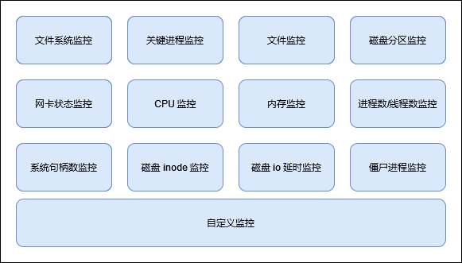

# sysmonitor

## 介绍

System Monitor Daemon

sysmonitor 负责监控 OS 系统运行过程中的异常，将监控到的异常记录到系统日志（`/var/log/sysmonitor.log`）中。sysmonitor 以服务的形式提供，可以通过 `systemctl start|stop|restart|reload sysmonitor` 启动、关闭、重启、重载服务。建议产品部署 sysmonitor 调测软件，便于定位系统异常问题。



### 注意事项

- sysmonitor 不支持并发执行。
- 各配置文件须合法配置，否则可能造成监控框架异常。
- sysmonitor 服务操作和配置文件修改，日志查询需要 root 权限。root 用户具有系统最高权限，在使用 root 用户进行操作时，请严格按照操作指导进行操作，避免不规范操作造成系统管理及安全风险。

### 配置总览

sysmonitor 有一个主配置文件(`/etc/sysconfig/sysmonitor`)，用于配置各监控项的监控周期、是否需要监控。配置项的=和"之间不能有空格,如`PROCESS_MONITOR="on"`。

配置说明

| 配置项                    | 配置项说明                                                   | 是否必配 | 默认值                                 |
| ------------------------- | ------------------------------------------------------------ | -------- | -------------------------------------- |
| PROCESS_MONITOR           | 设定是否开启关键进程监控，on为开启，off为关闭                | 否       | on                                   |
| PROCESS_MONITOR_PERIOD    | 设置关键进程监控的周期，单位秒                               | 否       | 3s                                     |
| PROCESS_RECALL_PERIOD     | 关键进程恢复失败后再次尝试拉起周期，单位分，取值范围为1到1440之间的整数 | 否       | 1min                                   |
| PROCESS_RESTART_TIMEOUT   | 关键进程服务异常恢复过程中超时时间，单位秒，取值范围为30至300之间的整数 | 否       | 90s                                    |
| PROCESS_ALARM_SUPRESS_NUM | 设置关键进程监控配置使用告警命令上报告警时的告警抑制次数，取值范围为正整数 | 否       | 5                                      |
| FILESYSTEM_MONITOR        | 设定是否开启 ext3/ext4 文件系统监控，on 为开启，off 为关闭   | 否       | on                                   |
| DISK_MONITOR              | 设定是否开启磁盘分区监控，on为开启，off 为关闭               | 否       | on                                   |
| DISK_MONITOR_PERIOD       | 设定磁盘监控周期，单位秒                                     | 否       | 60s                                    |
| INODE_MONITOR             | 设定是否开启磁盘 inode 监控，on 为开启， off 为关闭          | 否       | on                                   |
| INODE_MONITOR_PERIOD      | 设定磁盘 inode 监控周期，单位秒                              | 否       | 开启                                   |
| NETCARD_MONITOR           | 设定是否开启网卡监控，on 为开启， off 为关闭                 | 否       | on                                   |
| FILE_MONITOR              | 设定是否开启文件监控，on为开启， off 为关闭                  | 否       | on                                   |
| CPU_MONITOR               | 设定是否开启 cpu 监控，on 为开启， off 为关闭                    | 否       | on                                   |
| MEM_MONITOR               | 设定是否开启内存监控，on 为开启， off 为关闭                     | 否       | on                                   |
| PSCNT_MONITOR             | 设定是否开启进程数监控，on为开启，off 为关闭                     | 否       | on                                   |
| FDCNT_MONITOR             | 设定是否开启 fd 总数监控，on 为开启，off 为关闭                  | 否       | on                                   |
| CUSTOM_DAEMON_MONITOR     | 用户自定义的 daemon类型的监控项，on为开启，off为关闭         | 否       | on                                   |
| CUSTOM_PERIODIC_MONITOR   | 用户自定义的 periodic 类型的监控项，on为开启， off 为关闭    | 否       | on                                   |
| IO_DELAY_MONITOR          | 本地磁盘 IO 延时监控开关，on 为开启，off 为关闭              | 否       | off                                   |
| PROCESS_FD_NUM_MONITOR    | 设定是否开启单个进程句柄数监控，on为开启，off 为关闭         | 否       | on                                   |
| PROCESS_MONITOR_DELAY     | sysmonitor 启动时，是否等待所有的监控项都正常，on为等待，off为不等待 | 否       | on                                   |
| NET_RATE_LIMIT_BURST      | 网卡监控路由信息打印抑制频率，即一秒内打印多少条日志         | 否       | 5 <br />有效范围是 0-100，默认为5      |
| FD_MONITOR_LOG_PATH       | 文件句柄监控日志文件                                         | 否       | 默认配置路径为 /var/log/sysmonitor.log |
| ZOMBIE_MONITOR            | 僵尸进程监控开关                                             | 否       | off                                   |
| CHECK_THREAD_MONITOR      | 内部线程自愈开关，on为开启，off为关闭                        | 否       | on<br />若不配置，默认值为开启       |
| CHECK_THREAD_FAILURE_NUM  | 内部线程自愈的周期检查次数                                   | 否       | 默认值为3，范围为【2,10】              |

- 修改 `/etc/sysconfig/sysmonitor` 配置文件后，需要重启 sysmonitor 服务生效。
- 配置文件中，如果某一项没有配置，默认为监控项开启。
- 内部线程自愈开启后，当监控项子线程卡住，且超过配置的周期检查次数，会重启 sysmonitor 服务，进行恢复，会重新加载配置，对于配置的关键进程监控和自定义监控，会重新拉起执行。如果对于用户使用有影响，可以选择关闭该功能。

### 命令参考

- 启动监控服务

``` shell
systemctl start sysmonitor
```

- 关闭监控服务

``` shell
systemctl stop sysmonitor
```

- 重启监控服务

``` shell
systemctl restart sysmonitor
```

- 修改监控项的配置文件后，重载监控服务可使修改后的配置动态生效

``` shell
systemctl reload sysmonitor
```

### 监控日志

在默认情况下，为了防止 sysmonitor.log 文件过大，提供了切分转储日志的机制。日志将被转储到磁盘目录下，这样就能够保持一定量的日志。

配置文件为 `/etc/rsyslog.d/sysmonitor.conf`，因为增加了 rsyslog 配置文件，第一次安装 sysmonitor 后，需要重启 rsyslog 服务生效 sysmonitor 日志配置。

```sh
$template sysmonitorformat,"%TIMESTAMP:::date-rfc3339%|%syslogseverity-text%|%msg%\n"

$outchannel sysmonitor, /var/log/sysmonitor.log, 2097152, /usr/libexec/sysmonitor/sysmonitor_log_dump.sh
if ($programname == 'sysmonitor' and $syslogseverity <= 6) then {
:omfile:$sysmonitor;sysmonitorformat
stop
}

if ($msg contains 'Time has been changed') then {
:omfile:$sysmonitor;sysmonitorformat
stop
}

if ($programname == 'sysmonitor' and $syslogseverity > 6) then {
/dev/null
stop
}
```

## ext3/ext4  文件系统监控

### 简介

当文件系统出现故障时会导致 IO 操作异常从而引发操作系统一系列问题。通过文件系统故障检测及时发现，以便于系统管理员或用户及时处理故障，修复问题。

### 配置文件说明

无

### 异常日志

对于增加了 errors=remount-ro 挂载选项的文件系统，如果监控到 ext3/ext4文件系统故障，sysmonitor.log 中打印异常信息示例如下：

```sh
info|sysmonitor[127]: loop0 filesystem error. Remount filesystem read-only.
```

其他异常场景下，如果监控到 ext3/ext4 文件系统故障，sysmonitor.log 中打印异常信息示例如下：

```sh
info|sysmonitor[127]: fs_monitor_ext3_4: loop0 filesystem error. flag is 1879113728.
```

## 关键进程监控

### 简介

定期监控系统中关键进程，当系统内关键进程异常退出时，自动尝试恢复关键进程。如果恢复失败并需要告警，可上报告警。系统管理员能被及时告知进程异常退出事件，以及进程是否被恢复拉起。问题定位人员能从日志中定位进程异常退出的时间。

### 配置文件说明

配置目录为`/etc/sysmonitor/process`, 每个进程或模块一个配置文件。

```sh
USER=root
NAME=irqbalance
RECOVER_COMMAND=systemctl restart irqbalance
MONITOR_COMMAND=systemctl status irqbalance
STOP_COMMAND=systemctl stop irqbalance
```

各配置项如下：

| 配置项                 | 配置项说明                                                   | 是否必配 | 默认值                                              |
| ---------------------- | ------------------------------------------------------------ | -------- | --------------------------------------------------- |
| NAME                   | 进程或模块名                                                 | 是       | 无                                                  |
| RECOVER_COMMAND        | 恢复命令                                                     | 否       | 无                                                  |
| MONITOR_COMMAND        | 监控命令<br /> 命令返回值为0视为进程正常，命令返回大于 0视为进程异常 | 否       | pgrep -f $(which xxx) "xxx"为NAME字段中配置的进程名 |
| STOP_COMMAND           | 停止命令                                                     | 否       | 无                                                  |
| USER                   | 用户名 <br />使用指定的用户执行、监控、恢复、停止命令或脚本  | 否       | 如果配置项为空，则默认使用 root                     |
| CHECK_AS_PARAM         | 参数传递开关 <br />开关设置为 on 时，在执行 RECOVER_COMMAND 命令时，会将 MONITOR_COMMAND 的返回值作为入参，传给 RECOVER_COMMAND 命令或脚本。 开关为 off 或其他时，功能关闭 | 否       | 无                                                  |
| MONITOR_MODE           | 监控模式<br />- 配置为 parallel，并行监控<br />- 配置为 serial，串行监控 | 否       | serial                                              |
| MONITOR_PERIOD         | 监控周期<br />- 并行监控监控周期<br />- 监控模块配置为 serial，该配置项不生效 | 否       | 3                                                   |
| USE_CMD_ALARM          | 告警模式<br />配置为 on 或 ON，则使用告警命令上报告警        | 否       | 无                                                  |
| ALARM_COMMAND          | 上报告警命令                                                 | 否       | 无                                                  |
| ALARM_RECOVER_COMMAND | 恢复告警命令                                                 | 否       | 否                                                  |

- 修改关键进程监控的配置文件后，须执行 `systemctl reload sysmonitor`， 新的配置在一个监控周期后生效。
- 恢复命令和监控命令不阻塞，否则会造成关键进程监控线程异常。
- 当恢复命令执行超过 90 s时，会调用停止命令终止进程。
- 当恢复命令配置为空或不配置时，监控命令检查到关键进程异常时，不会尝试进行拉起。
- 当关键进程异常时，并且尝试拉起三次都不成功，最终会按照全局配置文件中配置的 PROCESS_RECALL_PERIOD 周期进行拉起。
- 当监控的进程不是 daemon 进程，MONITOR_COMMAND 必配。
- 若配置的关键服务在当前系统上不存在，则该监控不会生效，日志中会有相应提示；其他配置项，出现致命性错误，将使用默认配置，不报错。
- 配置文件权限为 600，监控项建议为 systemd 中的 service类型（如 MONITOR_COMMAND=systemctl status irqbalance）, 若监控的为进程，请确保 NAME 字段为绝对路径。
- sysmonitor 重启（restart）、重载（reload）、退出（stop）都不会影响所监控的进程或服务。
- 若 USE_CMD_ALARM 的配置为 on，ALARM_COMMAND、ALARM_RECOVER_COMMAND 的配置由用户保障。ALARM_COMMAND、ALARM_RECOVER_COMMAND 为空或没有配置，则不上报告警。
- 对于用户自行配置的命令，如监控命令，恢复命令，停止命令，上报告警命令，恢复告警命令等，命令的安全性由用户保证。命令由 root 权限执行，建议脚本命令权限设置为仅供 root 使用，避免普通用户提权风险。
- 配置监控命令的长度不大于200，大于 200，添加进程监控失败。
- 当恢复命令配置为 systemd 的重启服务命令时（如`RECOVER_COMMAND=systemctl restart irqbalance`），需注意是否与开源 systemd 恢复服务的机制冲突，否则可能会影响关键进程异常后的行为模式。
- 由 sysmonitor 恢复拉起的进程将和 sysmonitor 服务在同一个 Cgroup 当中，无法单独进行资源限制，因此建议优先使用开源 systemd 机制进行恢复。

### 异常日志

- 配置 RECOVER_COMMAND

  如果监控到进程或模块异常，/var/log/sysmonitor.log 中打印异常信息示例如下：

  ```sh
  info|sysmonitor[127]: irqbalance is abnormal, check cmd return 1, use "systemctl restart irqbalance" to recover
  ```

  如果监控到进程或模块恢复正常，/var/log/sysmonitor.log 中打印日志示例如下：

  ```sh
  info|sysmonitor[127]: irqbalance is recovered
  ```

- 不配置 RECOVER_COMMAND

  如果监控到进程或模块异常，/var/log/sysmonitor.log 中打印异常信息示例如下：

  ```sh
  info|sysmonitor[127]: irqbalance is abnormal, check cmd return 1, recover cmd is null, will not recover
  ```

  如果监控到进程或模块恢复正常，/var/log/sysmonitor.log 中打印日志示例如下：

  ```sh
  info|sysmonitor[127]: irqbalance is recovered
  ```

## 文件监控

### 简介

系统关键文件被意外删除后，会导致系统运行异常甚至崩溃。通过文件监控可以及时获知系统中关键文件被删除或者有恶意文件被添加，以便管理员和用户及时获知并处理故障。

### 配置文件说明

配置文件为 `/etc/sysmonitor/file`。每个监控配置项为一行，监控配置项包含两个内容：监控文件（目录）和监控事件。监控文件（目录）是绝对路径，监控文件（目录）和监控事件中间由一个或多个空格隔开。

配置文件支持在 `/etc/sysmonitor/file.d` 目录下增加文件监控项配置，配置方法与 `/etc/sysmonitor/file` 相同。

- 由于日志长度限制，建议配置的文件和目录绝对路径长度小于 223。如果配置的监控对象绝对路径长度超过223，可能会有日志打印不完整的现象出现。

- 请用户自行确保监控文件路径正确，如果配置文件不存在或路径错误则无法监控到该文件。

- 由于系统路径长度限制，监控的文件或目录绝对路径长度必须小于 4096。

- 支持监控目录和常规文件，/proc 和 /proc/*、/dev和/dev/*、/sys和/sys/* 管道文件 socket 文件等均不支持监控。

- /var/log 和 /var/log/* 均只支持删除事件。

- 当配置文件中存在多个相同路径的时候，以第一条合法配置为准，其他相同配置均不生效。在日志文件中可以查看到其他相同配置被忽略的提示。

- 不支持对软链接配置监控；当配置硬链接文件的删除事件时，需删除该文件和它的全部硬链接才会打印文件删除事件。

- 当文件添加监控成功及监控的事件发生时，监控日志打印的是配置文件中路径的绝对路径。

- 目前暂不支持目录递归监控，只能监控配置文件中的目录，子目录不会监控。

- 监控文件（目录）采用了位图的方式配置要监控的事件，对文件或目录进行监控的事件位图如下所示：

```sh
  -------------------------------
  | 11~32   | 10   | 9   |  1~8 | 
  -------------------------------
```

事件位图每一位代表一个事件，第N位如果置1，则表示监控第n位对应的事件；如果第 n 位置 0，则表示不监控第 n 位对应的事件。监控位图对应的 16 进制数，即是写到配置文件中的监控事件项。

| 配置项 | 配置项说明         | 是否必配 |
| ------ | ------------------ | -------- |
| 1~8    | 保留               | 否       |
| 9      | 文件、目录添加事件 | 是       |
| 10     | 文件、目录删除事件 | 是       |
| 11~32  | 保留               | 否       |

- 修改文件监控的配置文件后，须执行 `systemctl reload sysmonitor`，新的配置在最多 60 秒后生效。
- 监控事件需要严格遵守上述规则，如果配置有误，则无法监控；如果配置项中监控事件为空，则默认只监控删除事件，即 0x200。
- 文件或目录删除后，只有当所有打开该文件的进程都停止后才会上报删除事件。
- 监控的文件通过 vi、sed 等操作修改后会在监控日志中打印 File "XXX" may have been changed。
- 文件监控目前实现了对添加和删除事件的监控，即第9位和第10位有效，其他位为保留位，暂不生效。如果配置了保留位，监控日志会提示监控事件配置错误。

**示例**

配置对 /home 下子目录的增加和删除事件监控，低12 位位图为：001100000000，则可以配置如下：

```sh
/home 0x300
```

配置对 /etc/ssh/sshd_config 文件的删除事件监控，低12位位图为：001000000000，则可以配置如下：

```sh
/etc/sshd/sshd_config 0x200
```

### 异常日志

如果监控文件有配置的事件发生，/var/log/sysmonitor.log 中打印日志示例如下：

```sh
info|sysmonitor[127]: 1 events queued
info|sysmonitor[127]: 1th events handled
info|sysmonitor[127]: Subfile "111" under "/home" was added.
```

## 磁盘分区监控

### 简介

定期监控系统中挂载的磁盘分区空间，当磁盘分区使用率大于或等于用户设置的告警阈值时，记录磁盘空间告警。当磁盘分区使用率小于用户设置的告警恢复阈值时，记录磁盘空间恢复告警。

### 配置文件说明

配置文件为 `/etc/sysmonitor/disk`。

```sh
DISK="/var/log"  ALARM="90" RESUME="80"
DISK="/" ALARM="95" RESUME="85"
```

| 配置项 | 配置项说明             | 是否必配 | 默认值 |
| ------ | ---------------------- | -------- | ------ |
| DISK   | 磁盘挂载目录名         | 是       | 无     |
| ALARM  | 整数，磁盘空间告警阈值 | 否       | 90     |
| RESUME | 整数，磁盘空间恢复阈值 | 否       | 80     |

- 修改磁盘空间监控的配置文件后，须执行 systemctl reload sysmonitor，新的配置在一个监控周期后生效。
- 重复配置的挂载目录，最后一个配置项生效。
- ALARM 值应该大于 RESUME 值。
- 只能针对挂载点或被挂载点的磁盘分区做监控。
- 在 CPU 和 IO 高压场景下，df 命令执行超时，会导致磁盘利用率获取不到。
- 当多个挂载点对应同一个磁盘分区时，以挂载点为准来上报告警。

### 异常日志

如果监控到磁盘空间告警，`/var/log/sysmonitor.log` 中打印信息示例如下：

```sh
warning|sysmonitor[127]: report disk alarm, /var/log used:90% alarm:90%
info|sysmonitor[127]: report disk recovered, /var/log used:4% resume:10%
```

## 网卡状态监控

### 简介

系统运行过程中可能出现人为原因或异常而导致网卡状态或 IP 发生改变，对网卡状态和 IP 变化进行监控，以便及时感知到异常并方便定位异常原因。

### 配置文件说明

配置文件为 `/etc/sysmonitor/network`。

```sh
#dev event
eth1 UP
```

各配置项说明如下表

| 配置项 | 配置项说明                                                   | 是否必配 | 默认值                                            |
| ------ | ------------------------------------------------------------ | -------- | ------------------------------------------------- |
| dev    | 网卡名                                                       | 是       | 无                                                |
| event  | 侦听事件，可取 UP, DOWN,NEWADDR, DELADDR.<br />- UP： 网卡 UP<br />- DOWN： 网卡  DOWN<br />- NEWADDR： 增加 ip 地址<br />- DELADDR： 删除 ip 地址 | 否       | 若侦听事件为空则 UP，DOWN，NEWADDR，DELADDR都监控 |

- 修改网卡监控的配置文件后，执行 `systemctl reload sysmonitor`，新的配置生效。
- 不支持虚拟网卡 UP 和 DOWN 状态监控。
- 请确保网卡监控的配置文件每行少于 4096 个字符，若超过4096个字符会在监控日志中打印配置错误的提示信息。
- 默认监控所有网卡的所有事件信息，即不配置任何网卡，默认监控所有网卡的 UP，DOWN，NEWADDR，DELADDR 事件。
- 如果配置网卡，不配置事件，则默认监控改网卡的所有事件。
- 增加路由信息，默认一秒五条，可通过/etc/sysconfig/sysmonitor 的 NET_RATE_LIMIT_BURST 配置选项配置一秒钟打印路由信息数量。

### 异常日志

如果监控到配置的网卡事件，`/var/log/sysmonitor.log` 中打印信息示例如下：

```sh
info|sysmonitor[127]: lo: ip[::1] prefixlen[128] is added, comm: (ostnamed)[1046], parent comm: syst    emd[1]
info|sysmonitor[127]: lo: device is up, comm: (ostnamed)[1046], parent comm: systemd[1]
```

如果监控到路由事件, `/var/log/sysmonitor.log` 中打印信息示例如下：

```sh
info|sysmonitor[881]: Fib4 replace table=255 192.168.122.255/32, comm: daemon-init[1724], parent com    m: systemd[1]
info|sysmonitor[881]: Fib4 replace table=254 192.168.122.0/24, comm: daemon-init[1724], parent comm:     systemd[1]
info|sysmonitor[881]: Fib4 replace table=255 192.168.122.0/32, comm: daemon-init[1724], parent comm:     systemd[1]
info|sysmonitor[881]: Fib6 replace fe80::5054:ff:fef6:b73e/128, comm: kworker/1:3[209], parent comm:     kthreadd[2]
```

## cpu 监控

### 简介

监控系统全局或指定域内 cpu 的占用情况，当 cpu 使用率超出用户设置的告警阈值时，执行用户配置的日志收集命令。

### 配置文件说明

配置文件为`/etc/sysmonitor/cpu`。

当监控系统全局 cpu 时，配置文件示例如下：

```sh
# cpu usage alarm percent
ALARM="90"

# cpu usage alarm resume percent
RESUME="80"

# monitor period (second)
MONITOR_PERIOD="60"

# stat period (second)
STAT_PERIOD="300"

# command executed when cpu usage exceeds alarm percent
REPORT_COMMAND=""
```

当监控系统指定域 cpu 时，配置文件示例如下：

```sh
# monitor period (second)
MONITOR_PERIOD="60"

# stat period (second)
STAT_PERIOD="300"

DOMAIN="0,1"  ALARM="90" RESUME="80"
DOMAIN="2,3"  ALARM="50" RESUME="40"

# command executed when cpu usage exceeds alarm percent
REPORT_COMMAND=""
```

| 配置项         | 配置项说明                                                   | 是否必配 | 默认值 |
| -------------- | ------------------------------------------------------------ | -------- | ------ |
| ALARM          | 大于0，cpu 使用率告警阈值                                    | 否       | 90     |
| RESUME         | 大于等于0，cpu 使用率恢复阈值                                | 否       | 80     |
| MONITOR_PERIOD | 监控周期（秒），取值大于0                                    | 否       | 60     |
| STAT_PERIOD    | 统计周期（秒），取值大于0                                    | 否       | 300    |
| DOMAIN         | 域内的 cpu 信号，cpu 号均以十进制数字表示<br />- 可以通过列举方式指定，cpu 号之间通过逗号分隔，例如：1,2,3。也可以通过范围方式指定，格式 X-Y（X<Y）,例如：0-2。两种方式可以搭配使用，例如0,1,2-3 或 0-1,2-3。不要有空格等其他额外字符。<br />- 每个监控域单独一个配置项，每个项支持最多配置 256 个 cpu，域内以及域之间  cpu 号均不能重复 | 否       | 无     |
| REPORT_COMMAND | cpu 使用率超过告警阈值后的日志收集命令                       | 否       | 无     |

- 修改 cpu 监控的配置文件后，须执行 systemctl reload sysmonitor， 新的配置在一个监控周期后生效。
- ALARM 值应该大于 RESUME 值。
- 当配置监控 cpu 域后，不再对系统全局 cpu 平均使用率进行监控，单独配置的 ALARM、RESUME 值不生效。
- 如果某个监控域的配置存在非法，则整个 cpu 监控不执行。
- DOMAIN 内配置的 cpu 必须全部处于在线工作状态，否则对该域的监控无法正常进行。
- REPORT_COMMAND 项的命令不能包含 &、；、> 等不安全字符且总长度不能超过 159个字符，否则命令无法生效。
- REPORT_COMMAND 项的命令安全性、有效性由用户自己保证，sysmonitor 只负责以 root 用户执行该命令。
- REPORT_COMMAND 项的命令不能阻塞，当该命令执行时间超过 60s后，sysmonitor 会强行终止执行。
- 每轮监控即使有多个域 cpu 使用率超过阈值，REPORT_COMMAND 也仅会执行一次。

### 异常日志

如果监控到全局 cpu 使用率告警或恢复且配置了日志收集命令，`/var/log/sysmonitor.log` 中打印信息示例如下：

```sh
info|sysmonitor[127]: CPU usage alarm: 91.3%
info|sysmonitor[127]: cpu monitor: execute REPORT_COMMAND[sysmoniotrcpu] successfully
info|sysmonitor[127]: CPU usage resume 70.1%
```

如果监控到某个域的 cpu 平均使用率告警或恢复且配置了日志收集命令，`/var/log/sysmonitor.log` 中打印信息示例如下：

```sh
info|sysmonitor[127]: CPU 1,2,3 usage alarm: 91.3%
info|sysmonitor[127]: cpu monitor: execute REPORT_COMMAND[sysmoniotrcpu] successfully
info|sysmonitor[127]: CPU 1,2,3 usage resume 70.1%
```

## 内存监控

### 简介

监控系统内存占用情况，当内存使用率超出或低于阈值时，记录日志。

### 配置文件说明

配置文件为 `/etc/sysmonitor/memory`。

```sh
# memory usage alarm percent
ALARM="90"

# memory usage alarm resume percent
RESUME="80"

# monitor period(second)
PERIOD="60"
```

### 配置项说明

| 配置项 | 配置项说明                    | 是否必配 | 默认值 |
| ------ | ----------------------------- | -------- | ------ |
| ALARM  | 大于0，内存占用率告警阈值     | 否       | 90     |
| RESUME | 大于等于0，内存占用率恢复阈值 | 否       | 80     |
| PERIOD | 监控周期（秒），取值大于 0    | 否       | 60     |

- 修改内存监控的配置文件后，须执行 `systemctl reload sysmonitor`，新的配置在一个监控周期后生效。
- ALARM 值应该大于 RESUME值。
- 取三个监控周期的内存占用的平均值，来作为是否上报发生告警或恢复告警的依据。

### 异常日志

如果监控到内存告警，sysmonitor 获取 `/proc/meminfo` 信息，打印到 `/var/log/sysmonitor.log` 中，信息如下：

```sh
info|sysmonitor[127]: memory usage alarm: 90%
info|sysmonitor[127]:---------------show /proc/meminfo: ---------------
info|sysmonitor[127]:MemTotal: 3496388 kB
info|sysmonitor[127]:MemFree: 2738100 kB
info|sysmonitor[127]:MemAvailable: 2901888 kB
info|sysmonitor[127]:Buffers: 165064 kB
info|sysmonitor[127]:Cached: 282360 kB
info|sysmonitor[127]:SwapCached: 4492 kB
......
info|sysmonitor[127]:---------------show_memory_info end. ---------------
```

sysmonitor 有如下打印信息时，表示 sysmonitor 会调用 "echo m > /proc/sysrq-trigger" 命令导出内存分配的信息（可以在 /var/log/messages 中进行查看)。

```sh
info|sysmonitor[127]: sysrq show memory ifno in message。
```

告警恢复时，打印信息如下：

```sh
info|sysmonitor[127]: memory usage resume: 4.6%
```

## 进程数/线程数监控

### 简介

监控系统进程数目和线程数目，当进程总数或线程总数超出或低于阈值时，记录日志或上报告警。

### 配置文件说明

配置文件为 `/etc/sysmonitor/pscnt`。

```sh
# number of processes(include threads) when alarm occur
ALARM="1600"

# number of processes(include threads) when alarm resume
RESUME="1500"

# monitor period(second)
PERIOD="60"

# process count usage alarm percent
ALARM_RATIO="90"

# process count usage resume percent
RESUME_RATIO="80"

# print top process info with largest num of threads when threads alarm
# (range: 0-1024, default: 10, monitor for thread off:0)
SHOW_TOP_PROC_NUM="10"
```

| 配置项            | 配置项说明                                                   | 是否必配 | 默认值 |
| ----------------- | ------------------------------------------------------------ | -------- | ------ |
| ALARM             | 大于 0 的整数，进程总数告警阈值                              | 否       | 1600   |
| RESUME            | 大于等于0的整数，进程总数恢复阈值                            | 否       | 1500   |
| PERIOD            | 监控周期（秒），取值大于0                                    | 否       | 60     |
| ALARM_RATIO       | 大于0小于等于100的值，可以为小数。进程使用率告警阈值         | 否       | 90     |
| RESUME_RATIO      | 大于等于0小于100的值，可以为小数。进程使用率恢复阈值，必须必告警阈值小。 | 否       | 80     |
| SHOW_TOP_PROC_NUM | 使用线程数量最新 TOP 的进程信息                              | 否       | 10     |

- 修改进程数监控的配置文件后，须执行 `systemctl reload sysmonitor`，新的配置在一个监控周期后生效。
- ALARM 值应该大于 RESUME 值。
- 进程数告警产生阈值取 ALARM 值与 `/proc/sys/kernel/pid_max` 的 ALARM_RATIO 中的最大值，告警恢复阈值取 RESUME 值与 `/proc/sys/kernel/pid_max` 的 RESUME_RATIO 中的最大值。
- 线程数告警产生阈值取 ALARM 值与 `/proc/sys/kernel/threads-max` 的 ALARM_RATIO 中的最大值，告警恢复阈值取 RESUME 值与 `/proc/sys/kernel/threads-max` 的 RESUME_RATIO 中的最大值。
- SHOW_TOP_PROC_NUM 的取值范围为0-1024，为0时，表示不启用线程监控；当设置值较大时，如 1024，在环境中产生线程告警，且告警阈值较高时，会有性能影响，建议设置为默认值 10 及更小值，若影响较大，建议设置为 0，不启动线程监控。
- 线程监控启动时，由 `/etc/sysconfig/sysmonitor` 中 `PSCNT_MONITOR` 项和 `/etc/sysmonitor/pscnt` 中 `SHOW_TOP_PROC_NUM` 项设置。
    - `PSCNT_MONITOR` 为 on，且 `SHOW_TOP_PROC_NUM` 设置为合法值时，为启动。
    - `PSCNT_MONITOR` 为 on， `SHOW_TOP_PROC_NUM` 为 0时，为关闭。
    - `PSCNT_MONITOR` 为 off，为关闭。
- 进程数量告警时，增加打印系统句柄使用信息和内存信息（/proc/meminfo）。
- 线程数量告警时，会记录线程总数信息，TOP 进程信息，当前环境进程数量信息，系统句柄数信息，内存信息(/proc/meminfo)。
- 监控项监控周期到达前，若系统出现资源不足（如线程数超过系统最大线程数），则监控告警本身将由于资源受限无法正常运行，进而无法进行告警。

### 异常日志

如果监控到进程数告警，`/var/log/sysmonitor.log` 中打印信息示例如下：

```sh
info|sysmonitor[127]:---------------process count alarm start: ---------------
info|sysmonitor[127]: process count alarm:1657
info|sysmonitor[127]: process count alarm, show sys fd count: 2592
info|sysmonitor[127]: process count alarm, show mem info
info|sysmonitor[127]:---------------show /proc/meminfo: ---------------
info|sysmonitor[127]:MemTotal: 3496388 kB
info|sysmonitor[127]:MemFree: 2738100 kB
info|sysmonitor[127]:MemAvailable: 2901888 kB
info|sysmonitor[127]:Buffers: 165064 kB
info|sysmonitor[127]:Cached: 282360 kB
info|sysmonitor[127]:SwapCached: 4492 kB
......
info|sysmonitor[127]:---------------show_memory_info end. ---------------
info|sysmonitor[127]:---------------process count alarm end: ---------------
```

如果监控到进程数恢复告警，`/var/log/sysmonitor.log` 中打印信息示例如下：

```sh
info|sysmonitor[127]: process count resume: 1200
```

如果监控到线程数告警，`/var/log/sysmonitor.log` 中打印信息示例如下：

```sh
info|sysmonitor[127]:---------------threads count alarm start: ---------------
info|sysmonitor[127]:threads count alarm: 273
info|sysmonitor[127]:open threads most 10 processes is [top1:pid=1756900,openthreadsnum=13,cmd=/usr/bin/sysmonitor --daemon]
info|sysmonitor[127]:open threads most 10 processes is [top2:pid=3130,openthreadsnum=13,cmd=/usr/lib/gassproxy -D]
.....
info|sysmonitor[127]:---------------threads count alarm end. ---------------
```

## 系统句柄总数监控

### 简介

监控系统文件句柄（fd）数目，当系统文件句柄总数超过或低于阈值时，记录日志。

### 配置文件说明

配置文件为 `/etc/sysmonitor/sys_fd_conf`。

```sh
# system fd usage alarm percent
SYS_FD_ALARM="80"
# system fd usage alarm resume percent
SYS_FD_RESUME="70"
# monitor period (second)
SYS_FD_PERIOD="600"
```

配置项说明：

| 配置项        | 配置项说明                                                | 是否必配 | 默认值 |
| ------------- | --------------------------------------------------------- | -------- | ------ |
| SYS_FD_ALARM  | 大于0小于100的整数，fd总数与系统最大 fd数百分比的告警阈值 | 否       | 80%    |
| SYS_FD_RESUME | 大于0小于100的整数，fd 总数与系统最大fd数百分比的恢复阈值 | 否       | 70%    |
| SYS_FD_PERIOD | 监控周期（秒），取值为100~86400 之间的整数                | 否       | 600    |

- 修改fd 总数监控的配置文件后，须执行 `systemctl reload sysmonitor`，新的配置在一个监控周期后生效。
- `SYS_FD_ALARM` 值应该大于 `SYS_FD_RESUME` 值，当配置非法时，会使用默认值，并打印日志。

### 异常日志

如果监控到 fd 总数告警，在监控日志中打印告警。`/var/log/sysmonitor.log` 中打印信息示例如下：

```sh
info|sysmonitor[127]: sys fd count alarm: 259296
```

系统句柄使用告警时，会打印前三个使用句柄数最多的进程：

```sh
info|sysmonitor[127]:open fd most three processes is:[top1:pid=23233,openfdnum=5000,cmd=/home/openfile]
info|sysmonitor[127]:open fd most three processes is:[top2:pid=23267,openfdnum=5000,cmd=/home/openfile]
info|sysmonitor[127]:open fd most three processes is:[top3:pid=30144,openfdnum=5000,cmd=/home/openfile]
```

## 磁盘 inode 监控

### 简介

定期监控系统中挂载的磁盘分区 inode，当磁盘分区 inode 使用率大于或等于用户设置的告警阈值，记录磁盘 inode 告警。发生告警后，当磁盘分区 inode 使用率小于用户设置的告警恢复阈值，记录磁盘 inode 恢复告警。

### 配置文件说明

配置文件为 `/etc/sysmonitor/inode`。

```sh
DISK="/"
DISK="/var/log"
```

| 配置项 | 配置项说明                | 是否必配 | 默认值 |
| ------ | ------------------------- | -------- | ------ |
| DISK   | 磁盘挂载目录名            | 是       | 无     |
| ALARM  | 整数，磁盘 inode 告警阈值 | 否       | 90     |
| RESUME | 整数，磁盘 inode 恢复阈值 | 否       | 80     |

- 修改磁盘 inode 监控的配置文件后，须执行 `systemctl reload sysmonitor`，新的配置在一个监控周期后生效。
- 重复配置的挂载目录，最后一个配置项生效。
- ALARM 值应该大于 RESUME 值。
- 只能针对挂载点或被挂载的磁盘分区做监控。
- 在 CPU 和 IO 高压场景下，df 执行命令超时，会导致磁盘 inode 利用率获取不到。
- 当多个挂载点对应同一个磁盘分区，以挂载点为准来上报告警。

### 异常日志

如果监控到磁盘 inode 告警，`/var/log/sysmonitor.log`中打印信息示例如下：

```sh
info|sysmonitor[4570]:report disk inode alarm, /var/log used:90% alarm:90%
info|sysmonitor[4570]:report disk inode recovered, /var/log used:79% alarm:80%
```

## 本地磁盘 io 延时监控

### 简介

每5秒读取一次本地磁盘 io 延时数据，每五分钟对在该五分钟内60组数据进行统计，如果有多于30次（一半）的数据大于配置的最大 IO 延时数据，则记录该磁盘的 IO 延时过大日志。

### 配置文件说明

配置文件为 `/etc/sysmonitor/iodelay`。

```sh
DELAY_VALUE="500"
```

| 配置项      | 配置项说明           | 是否必配 | 默认值 |
| ----------- | -------------------- | -------- | ------ |
| DELAY_VALUE | 磁盘 IO 延时的最大值 | 是       | 500    |

### 异常日志

如果监控到本地磁盘 IO 延时过大告警，`/var/log/sysmonitor.log` 中打印信息示例如下：

```sh
info|sysmonitor[127]:local disk sda IO delay is too large, I/O delay threshold is 70.
info|sysmonitor[127]:disk is sda, io delay data: 71 72 75 87 99 29 78 ......
```

如果监控到本地磁盘 IO 延时告警恢复，`/var/log/sysmonitor.log` 中打印信息示例如下：

```sh
info|sysmonitor[127]:local disk sda IO delay is normal, I/O delay threshold is 70.
info|sysmonitor[127]:disk is sda, io delay data: 11 22 35 8 9 29 38 ......
```

## 僵尸进程监控

### 简介

监控系统僵尸进程数量，大于告警阈值，记录告警日志。当系统僵尸进程数小于恢复阈值时，告警恢复。

### 配置文件说明

配置文件为`/etc/sysmonitor/zombie`。

```sh
# Ceiling zombie process counts of alarm
ALARM="500"

# Floor zombie process counts of resume
RESUME="400"

# Periodic (second)
PERIOD="600"
```

| 配置项 | 配置项说明                      | 是否必配 | 默认值 |
| ------ | ------------------------------- | -------- | ------ |
| ALARM  | 大于0，僵尸进程个数告警阈值     | 否       | 500    |
| RESUME | 大于等于0，僵尸进程个数恢复阈值 | 否       | 400    |
| PERIOD | 监控周期（秒），取值大于0       | 否       | 60     |

### 异常日志

如果监控到僵尸进程个数告警，`/var/log/sysmonitor.log`中打印信息如下:

```sh
info|sysmonitor[127]: zombie process count alarm: 600
info|sysmonitor[127]: zombie process count resume: 100
```

## 自定义监控

### 简介

用户可以自定义监控项，监控框架读取配置文件内容，解析配置文件各监控属性，在监控框架里调用用户要执行的监控动作。监控模块仅提供监控框架，不感知用户在监控的内容以及如何监控，不负责上报告警。

### 配置文件说明

配置文件位于`/etc/sysmonitor.d/`路径下,每个进程或模块对应一个配置文件。

```sh
MONITOR_SWITCH="on"
TYPE="periodic"
EXECSTART="/usr/sbin/iomonitor_daemon"
PERIOD="1800"
```

| 配置项         | 配置项说明                                                   | 是否必配              | 默认值 |
| -------------- | ------------------------------------------------------------ | --------------------- | ------ |
| MONITOR_SWITCH | 监控开关                                                     | 否                    | off    |
| TYPE           | 自定义监控项的类型<br />daemon：后台运行<br />periodic：周期运行 | 是                    | 无     |
| EXECSTART      | 执行监控命令                                                 | 是                    | 无     |
| ENVIROMENTFILE | 环境变量存放文件                                             | 否                    | 无     |
| PERIOD         | 若 type 为 periodic 类型，此为必配项，为自定义监控的周期，取值为大于0的整数 | periodic 类型为必配项 | 无     |

- 配置文件名称，环境变量文件名称，加上绝对路径总长度不能超过127个字符。环境变量文件必须为绝对路径和实际路径，不能是软链接路径。
- EXECSTART项的命令总长度不能超过159个字符，关键字段配置不能有空格。
- 周期性监控的执行命令不能超时，否则对自定义监控框架产生影响。
- 目前支持配置的环境变量最多为256个。
- daemon 类型的自定义监控每间隔10s会统一查询是否有 reload 命令下发，或者是否有 daemon 进程异常退出；如果有reload 命令下发，需要等待 10s 后才会重新加载新的配置，如果有 daemon 进程异常退出，需要等待 10s才会重新拉起。
- ENVIROMENTFLE 对应的文件中的内容发生变化，如新增环境变量，或环境变量的值发生变化，需要重启 sysmonitor 服务，新的环境变量才能生效。
- `/etc/sysmonitor.d/`目录下的配置文件权限建议为 600， EXECSTART 项中若只配置了执行文件，则执行文件的权限建议为 550。
- daemon 进程异常退出后，sysmonitor 会重新加载该 daemon进程的配置文件。

### 异常日志

如果 daemon 类型监控项异常退出，/var/log/sysmonitor.log 中会有如下记录：

```sh
info|sysmonitor[127]: custom daemon monitor: child process[11609] name unetwork_alarm exit code[127],[1] times.
```
